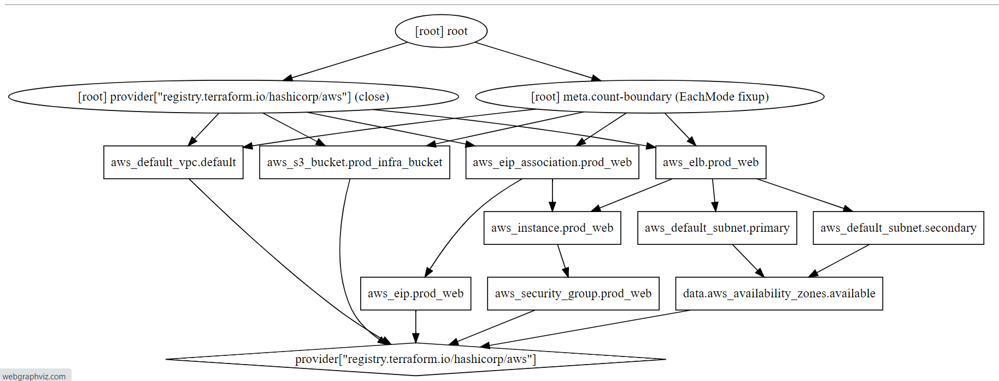

# Basic Infra

> S3 bucket, EC2 nginx instance x2, load balancer, static IP, security group with ingress filtering port 80 & 443, default VPC and available availability zones for subnets.

## Quickstart

```sh
run.sh
```



- provider.aws
- aws_default_vpc.default
- data.aws_availability_zones.available
- aws_default_subnet.primary
- aws_default_subnet.secondary
- aws_eip_association.prod_web
- aws_eip.prod_web
- aws_elb.prod_web
- aws_instance.prod_web[0]
- aws_instance.prod_web[1]
- aws_s3_bucket.prod_infra_bucket
