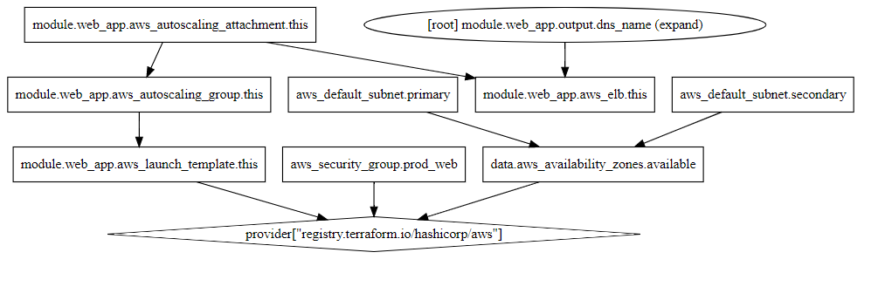
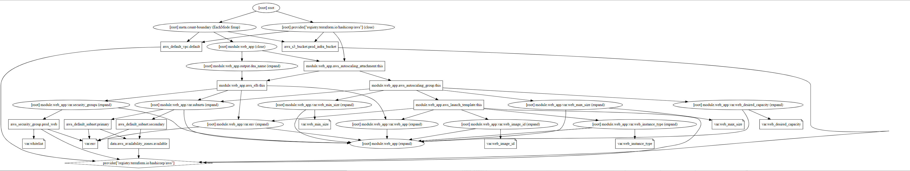
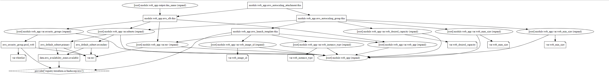

# aws-terra

templates

## Init

```sh
./run.sh
```

- provider.aws
- data.aws_availability_zones.available
- aws_default_subnet.primary
- aws_default_subnet.secondary
- aws_default_vpc.default
- aws_s3_bucket.prod_infra_bucket
- aws_security_group.prod_web
- module.web_app.aws_autoscaling_attachment.this
- module.web_app.aws_autoscaling_group.this
- module.web_app.aws_elb.this
- module.web_app.aws_launch_template.this






